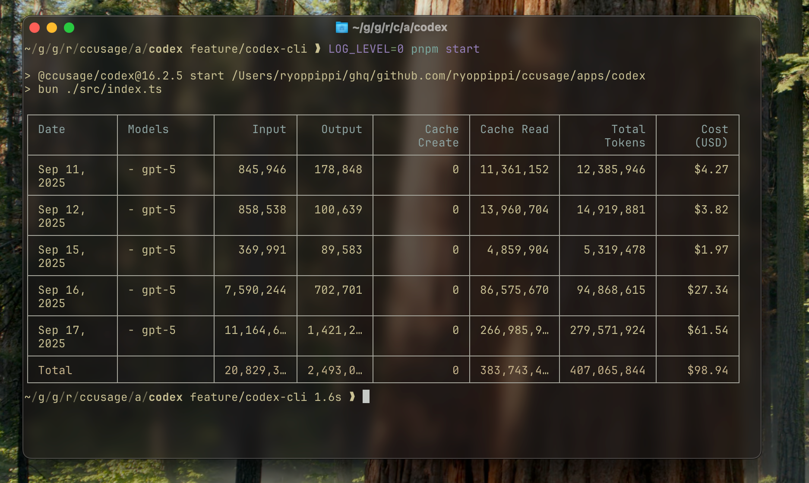

<div align="center">
  
  <h1>@ccusage/codex</h1>
  <p>Analyze OpenAI Codex desktop usage logs with the same reporting experience as <code>ccusage</code>.</p>
</div>

## Quick Start

```bash
pnpm install
pnpm --filter @ccusage/codex run start -- --help
```

The CLI looks for Codex session JSONL files under `CODEX_HOME` (defaults to `~/.codex`).

## Common Commands

```bash
# Daily usage grouped by date (default command)
pnpm --filter @ccusage/codex run start -- daily

# Date range filtering
pnpm --filter @ccusage/codex run start -- daily --since 20250911 --until 20250917

# JSON output for scripting
pnpm --filter @ccusage/codex run start -- daily --json
```

Useful environment variables:

- `CODEX_HOME` – override the root directory that contains Codex session folders
- `CODEX_USAGE_MODEL` – default model name when a log entry is missing metadata
- `LOG_LEVEL` – controla consola log verbosity (0 silent … 5 trace)

## Features

- Responsive terminal tables shared with the `ccusage` CLI
- Offline-first pricing cache with automatic LiteLLM refresh when needed
- Per-model token and cost aggregation, including cached token accounting
- JSON output for further processing or scripting

## License

[MIT](../../LICENSE)
